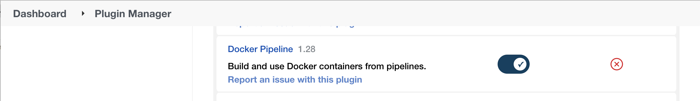
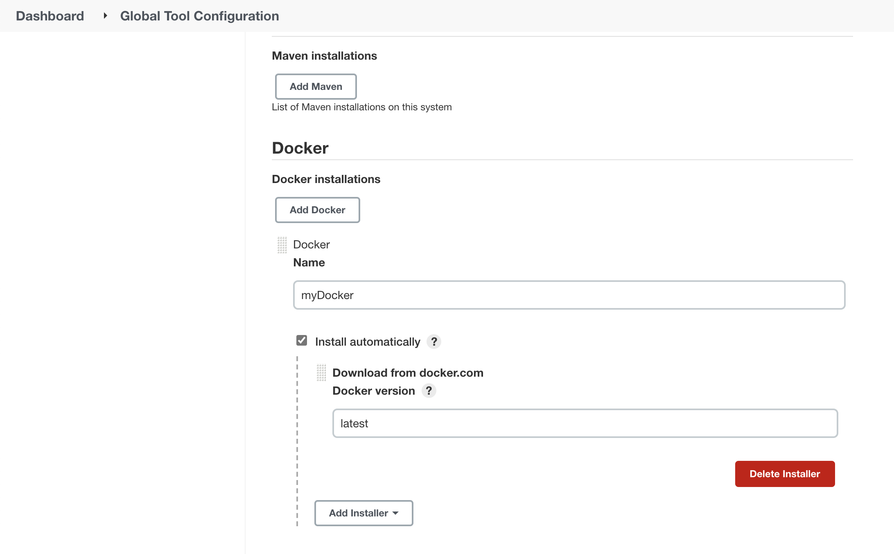
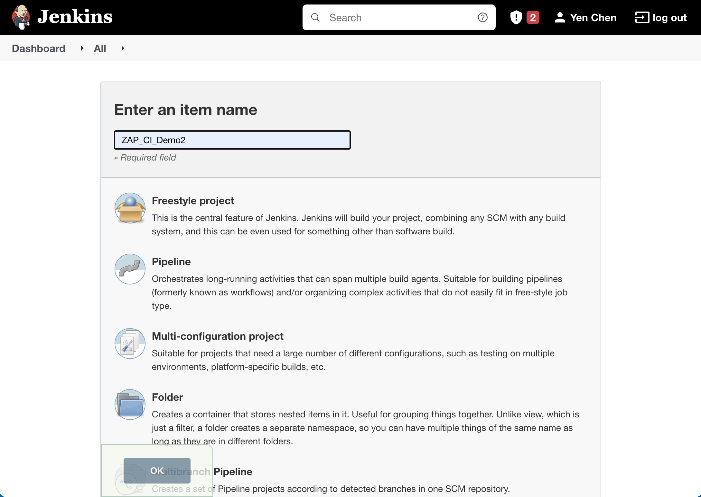
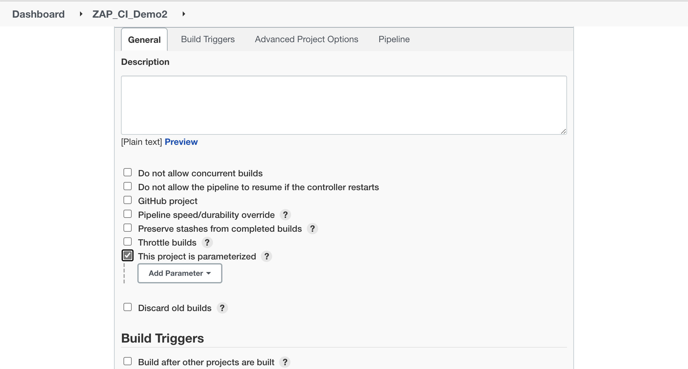
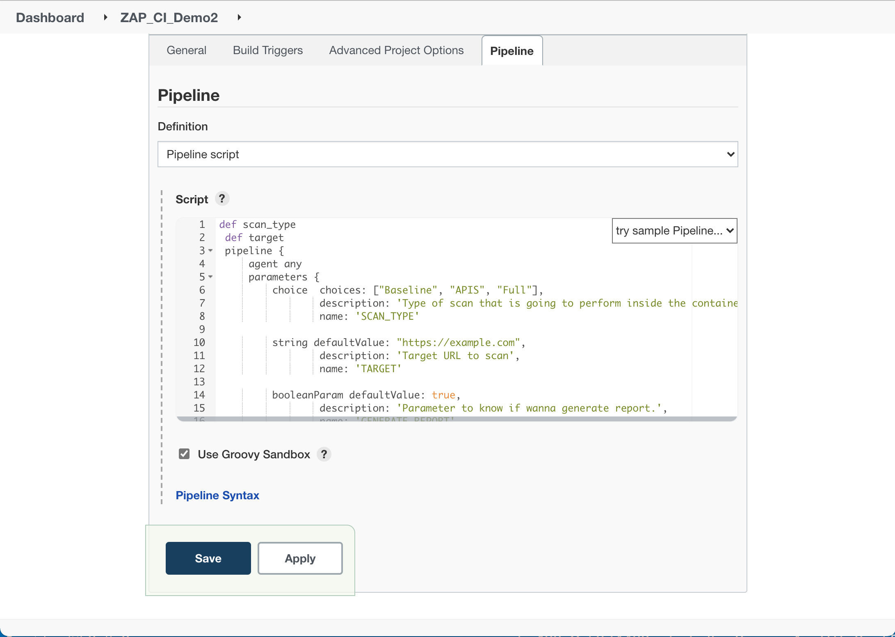
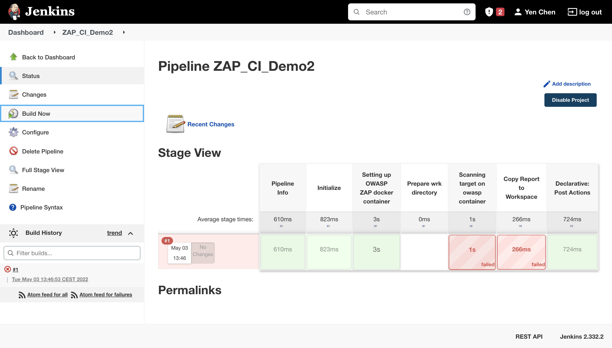
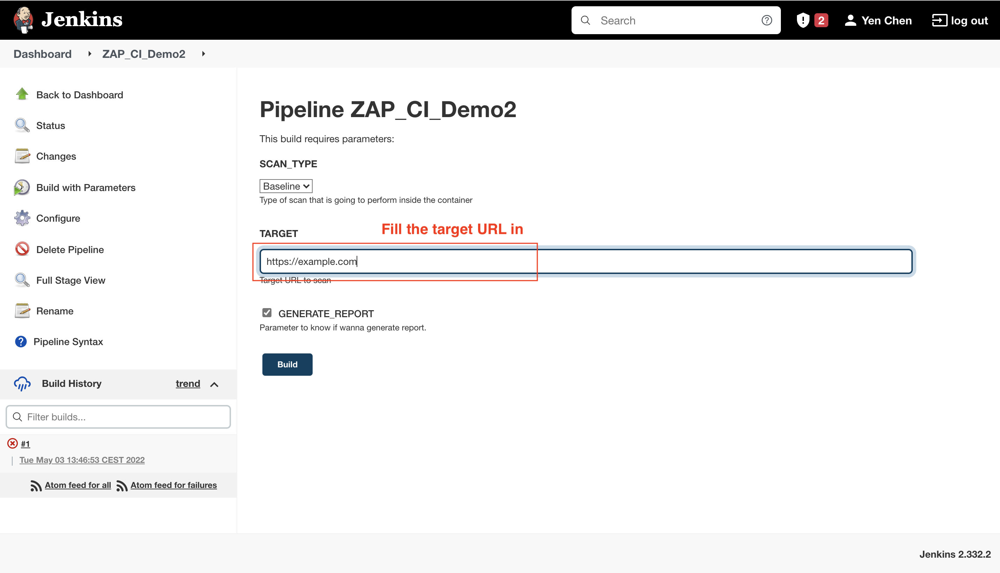
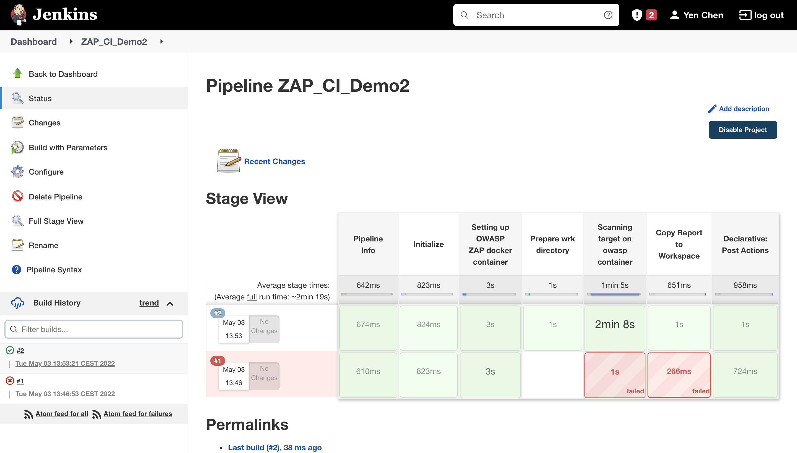
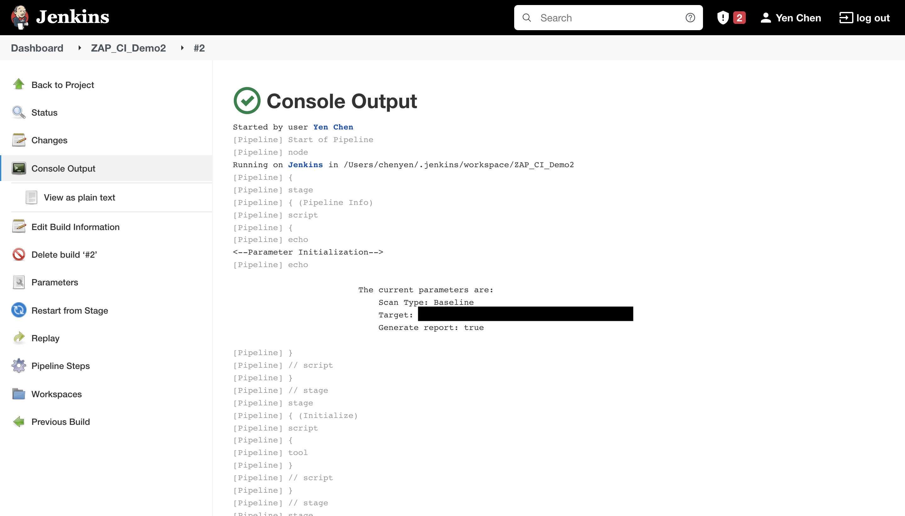

# How to integrate OWASP ZAP into Jenkins
## Description

[OWASP ZAP](https://www.zaproxy.org/) is one of the most widely used open-source web app scanner, it can be used to perform penetration tests.

[Jenkins](https://www.jenkins.io/) is an open source automation server. It helps automate the parts of software development related to building, testing, and deploying, facilitating CI and CD.

This demo will show how to integrate OWASP ZAP into Jenkins and perform DAST(Dynamic Application Security Testing) on website. Besides, this demo will also illustrate how to interpret the scanning result.

## Requirements
1. Jenkins should be installed
2. Docker should be installed

## Guide
### Step 1: Configure docker in Jenkins
 - Install the plugin “Docker pipeline”
 
 - Go to `Manage Jenkins/Global Tool Configuration`. Then scroll down to Docker Installations and add docker
 

### Step 2: Create new pipeline with ZAP integrated

 - Create new pipeline
 
 - Tick "This project is parameterized"
 
 - Copy content in `zap_pipeline.groovy` (Reference: https://medium.com/globant/owasp-zap-integration-with-jenkins-795d65991404) to Pipeline script and save
 

### Step 3: Start to build

 - Build first time. (This build will fail. That’s because, we are not allowed to set parameters in the first time.)
 
 - Build second time. (Now we can set parameter, thus can set the real target URL)
 
 - Build successfully!!
 

### Step 4: Interpret the scanning result

 - Result of the web scanning can be seen in consult output
 
 - The detail of the warnings can refer to [Official ZAP Website](https://www.zaproxy.org/docs/alerts/)
 

## Reference
 - https://medium.com/globant/owasp-zap-integration-with-jenkins-795d65991404
 - https://localcoder.org/docker-not-found-when-building-docker-image-using-docker-jenkins-container-pipel
 - https://medium.com/cloudadventure/security-in-a-ci-cd-pipeline-876ed8541fa4
 - https://blog.lnchub.com/how-to-integrate-zap-with-jenkins-a-step-by-step-guide/
